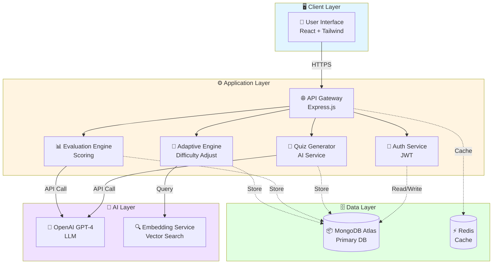
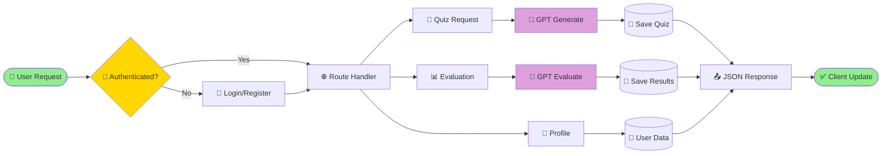
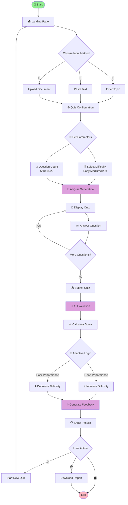
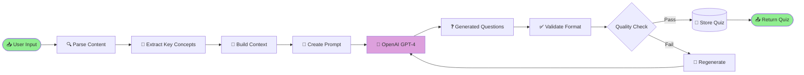
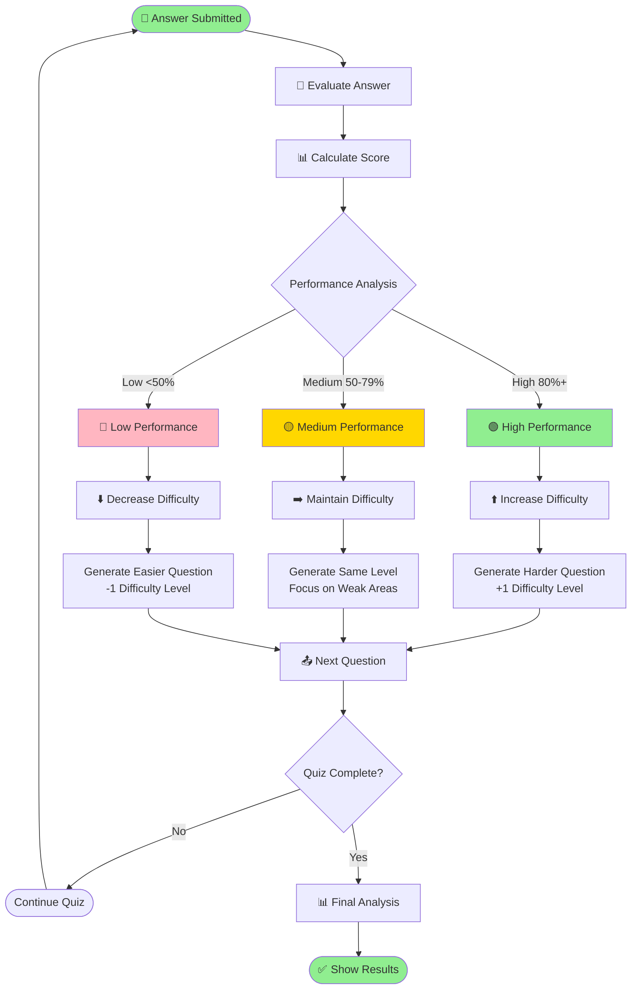
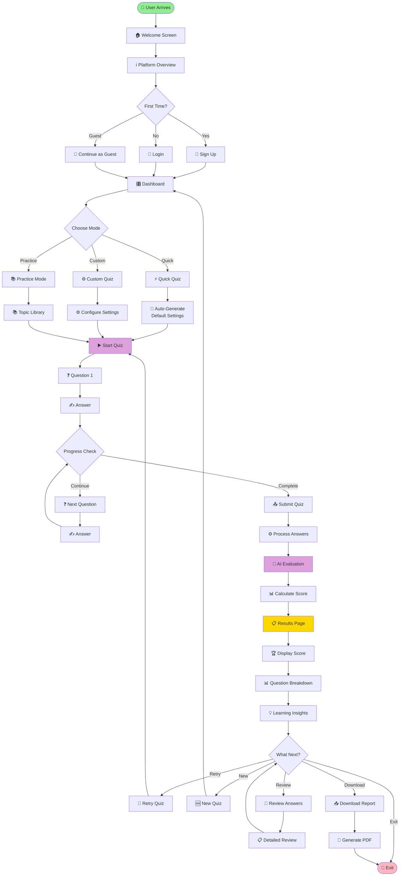
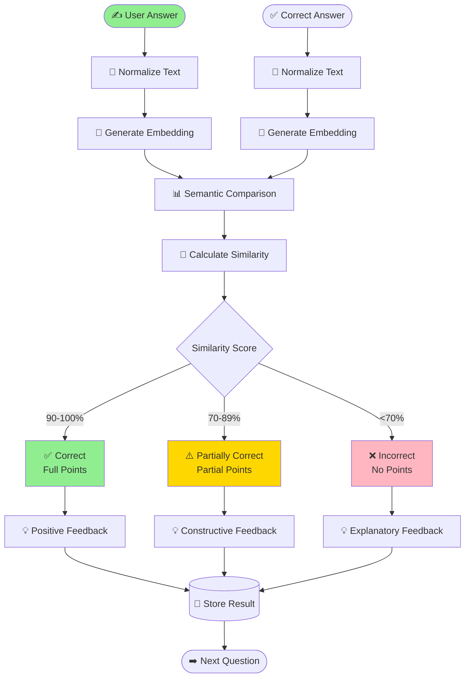

# 🚀✨ SMARTQUIZZER - Adaptive AI-Based Quiz Generator

<div align="center">


[](LICENSE)
[](VERSION)

**An AI-powered adaptive quiz platform that personalizes learning through intelligent evaluation, dynamic difficulty adjustment, and actionable feedback.**

[🌐 Live Demo]https://smartquizzer-adaptive-ai-based-quiz-7shn.onrender.com/) | [📖 Documentation](#) | [🐛 Report Bug](#) | [✨ Request Feature](#)

</div>

---

## 📑 Table of Contents

- [🧠 Overview](#-overview)
- [✨ Key Features](#-key-features)
- [🎯 Target Audience](#-target-audience)
- [🛠️ Technology Stack](#️-technology-stack)
- [🏗️ System Architecture](#️-system-architecture)
- [🔄 Application Flow](#-application-flow)
- [🧩 Adaptive Learning Engine](#-adaptive-learning-engine)
- [🚶‍♂️ User Journey](#️-user-journey)
- [🤖 AI Evaluation System](#-ai-evaluation-system)
- [📊 Learning Analytics](#-learning-analytics)
- [🚀 Getting Started](#-getting-started)
- [🔮 Future Roadmap](#-future-roadmap)
- [👥 Contributing](#-contributing)
- [📄 License](#-license)

---

## 🧠 Overview

**SmartQuizzer** is not just another quiz application—it's an **intelligent learning companion** that transforms the traditional assessment experience into a personalized learning journey. By leveraging advanced **Large Language Models (LLMs)** and **adaptive algorithms**, SmartQuizzer creates a dynamic educational environment that responds to each learner's unique needs.

### 🎓 What Makes SmartQuizzer Different?

| Traditional Quiz Apps | 🚀 SmartQuizzer |
|----------------------|-----------------|
| ❌ Static questions from database | ✅ AI-generated contextual questions |
| ❌ Fixed difficulty levels | ✅ Real-time difficulty adaptation |
| ❌ Simple right/wrong marking | ✅ Semantic answer evaluation |
| ❌ Generic feedback | ✅ Personalized learning recommendations |
| ❌ One-time assessment | ✅ Continuous learning loops |
| ❌ Limited content sources | ✅ Multiple input methods (topics, text, documents) |

### 🎯 Core Philosophy

> **"Assessment shouldn't just measure learning—it should drive it."**

SmartQuizzer operates on three fundamental principles:

1. **🧠 Adaptive Intelligence** - Questions evolve based on your performance
2. **💡 Semantic Understanding** - AI evaluates meaning, not just keywords
3. **🎯 Targeted Growth** - Personalized feedback guides your learning path

---

## ✨ Key Features

### 🔥 Core Capabilities

<table>
<tr>
<td width="50%">

#### 🎨 **Multi-Source Quiz Generation**
- 📝 **Topic-Based**: Enter any subject
- 📄 **Text-Based**: Paste content directly
- 📁 **Document Upload**: PDF, DOCX support
- 🌐 **URL Import**: Learn from web articles

</td>
<td width="50%">

#### 🧠 **Intelligent Evaluation**
- ✅ Semantic answer matching
- 📊 Context-aware scoring
- 💬 Natural language understanding
- 🎯 Partial credit allocation

</td>
</tr>
<tr>
<td width="50%">

#### 📈 **Adaptive Difficulty**
- 🔄 Real-time adjustment
- 📊 Performance-based scaling
- 🎓 Learning curve optimization
- ⚡ Dynamic question selection

</td>
<td width="50%">

#### 📋 **Comprehensive Analytics**
- 📊 Performance tracking
- 📉 Weakness identification
- 🎯 Strength analysis
- 📈 Progress visualization

</td>
</tr>
<tr>
<td width="50%">

#### 💡 **Personalized Feedback**
- 🎯 Concept-specific insights
- 📚 Study recommendations
- 🔍 Gap analysis
- 🗺️ Learning path suggestions

</td>
<td width="50%">

#### 📥 **Export & Sharing**
- 📄 PDF report generation
- 📊 Performance certificates
- 📈 Progress reports
- 🔗 Shareable results

</td>
</tr>
</table>

---

## 🎯 Target Audience

<table>
<tr>
<th>👥 User Group</th>
<th>🎯 Use Cases</th>
<th>✅ Benefits</th>
</tr>
<tr>
<td>

**🎓 Students**
- K-12 learners
- College students
- Graduate students
- Self-learners

</td>
<td>

- Exam preparation
- Concept revision
- Self-assessment
- Knowledge validation

</td>
<td>

- Personalized learning
- Immediate feedback
- Progress tracking
- Confidence building

</td>
</tr>
<tr>
<td>

**👨‍🏫 Educators**
- Teachers
- Professors
- Tutors
- Course creators

</td>
<td>

- Student assessment
- Homework generation
- Quick quizzes
- Formative evaluation

</td>
<td>

- Time savings
- Customization
- Analytics insights
- Engagement tools

</td>
</tr>
<tr>
<td>

**💼 Professionals**
- Job seekers
- Career changers
- Skill upgraders
- Certification seekers

</td>
<td>

- Interview prep
- Skill assessment
- Knowledge refresh
- Certification practice

</td>
<td>

- Targeted preparation
- Weakness identification
- Confidence boosting
- Career advancement

</td>
</tr>
<tr>
<td>

**🏢 Organizations**
- HR departments
- Training teams
- L&D professionals
- Corporate trainers

</td>
<td>

- Employee assessment
- Onboarding
- Compliance training
- Skill verification

</td>
<td>

- Scalable assessment
- Consistent evaluation
- Performance metrics
- Training ROI

</td>
</tr>
</table>

---

## 🛠️ Technology Stack

### 📊 Technology Architecture

<table>
<tr>
<th>🏗️ Layer</th>
<th>⚙️ Technology</th>
<th>📝 Purpose</th>
<th>🔧 Version</th>
</tr>
<tr>
<td>

**🎨 Frontend**

</td>
<td>

- React.js
- Tailwind CSS
- Axios
- React Router

</td>
<td>

- Dynamic UI
- Responsive design
- API communication
- Navigation

</td>
<td>

- v18.2+
- v3.3+
- v1.6+
- v6.20+

</td>
</tr>
<tr>
<td>

**⚙️ Backend**

</td>
<td>

- Node.js
- Express.js
- JWT
- Bcrypt

</td>
<td>

- Server runtime
- API framework
- Authentication
- Security

</td>
<td>

- v18+
- v4.18+
- v9.0+
- v5.1+

</td>
</tr>
<tr>
<td>

**🗄️ Database**

</td>
<td>

- MongoDB Atlas
- Mongoose
- Redis (cache)

</td>
<td>

- Data storage
- ODM
- Session management

</td>
<td>

- v6.0+
- v7.5+
- v4.6+

</td>
</tr>
<tr>
<td>

**🤖 AI/ML**

</td>
<td>

- OpenAI GPT-4
- LangChain
- Vector DB

</td>
<td>

- Quiz generation
- Answer evaluation
- Semantic search

</td>
<td>

- Latest
- v0.1+
- Latest

</td>
</tr>
<tr>
<td>

**☁️ Deployment**

</td>
<td>

- Render
- MongoDB Atlas
- Cloudflare

</td>
<td>

- App hosting
- Database hosting
- CDN & Security

</td>
<td>

- Latest
- Cloud
- Latest

</td>
</tr>
<tr>
<td>

**🔧 Dev Tools**

</td>
<td>

- Git & GitHub
- VS Code
- Postman
- ESLint

</td>
<td>

- Version control
- Development
- API testing
- Code quality

</td>
<td>

- Latest
- Latest
- Latest
- Latest

</td>
</tr>
</table>

---

## 🏗️ System Architecture

### 📐 High-Level Architecture Diagram



### 🔄 Request Flow Architecture



---

## 🔄 Application Flow

### 📋 Complete System Flow Diagram



### 🔄 Quiz Generation Pipeline



---

## 🧩 Adaptive Learning Engine

### 🎯 How Adaptive Difficulty Works

The SmartQuizzer Adaptive Engine dynamically adjusts question difficulty based on real-time performance analysis. This ensures learners are always challenged at the optimal level—not too easy, not too hard.

#### 📊 Adaptation Algorithm

<table>
<tr>
<th>📈 Performance Metric</th>
<th>🎯 Action Taken</th>
<th>📊 Difficulty Change</th>
</tr>
<tr>
<td>

**🟢 High Score (80%+)**
- Consistent correct answers
- Fast response time
- Advanced understanding

</td>
<td>

**⬆️ Increase Difficulty**
- Generate harder questions
- Introduce complex concepts
- Add multi-step problems

</td>
<td>

**+1 Level**
Easy → Medium
Medium → Hard
Hard → Expert

</td>
</tr>
<tr>
<td>

**🟡 Medium Score (50-79%)**
- Mixed results
- Some conceptual gaps
- Moderate understanding

</td>
<td>

**➡️ Maintain Difficulty**
- Keep current level
- Reinforce concepts
- Provide targeted hints

</td>
<td>

**No Change**
Same difficulty
Focus on weak areas

</td>
</tr>
<tr>
<td>

**🔴 Low Score (<50%)**
- Frequent errors
- Foundational gaps
- Struggling with basics

</td>
<td>

**⬇️ Decrease Difficulty**
- Simplify questions
- Break down concepts
- Focus on fundamentals

</td>
<td>

**-1 Level**
Hard → Medium
Medium → Easy
Easy → Beginner

</td>
</tr>
</table>

### 🔄 Adaptive Flow Diagram



### 📈 Difficulty Calculation Formula

**Difficulty Score = Base Difficulty + Performance Modifier + Time Modifier**

| Component | Weight | Range |
|-----------|--------|-------|
| Base Difficulty | 40% | 1-10 |
| Correct Answer Rate | 30% | -3 to +3 |
| Response Time | 15% | -2 to +2 |
| Streak Bonus | 15% | 0 to +2 |

---

## 🚶‍♂️ User Journey

### 🗺️ Complete User Experience Flow



### 📱 Screen-by-Screen Breakdown

#### 1️⃣ Landing Screen

<table>
<tr>
<th>🎨 Element</th>
<th>🎯 Purpose</th>
<th>✨ Features</th>
</tr>
<tr>
<td>

**Hero Section**

</td>
<td>

Capture attention and communicate value proposition

</td>
<td>

- Animated headline
- Feature highlights
- CTA buttons
- Demo video

</td>
</tr>
<tr>
<td>

**Feature Showcase**

</td>
<td>

Display key platform capabilities

</td>
<td>

- Icon cards
- Benefit statements
- Visual examples
- User testimonials

</td>
</tr>
<tr>
<td>

**Social Proof**

</td>
<td>

Build trust and credibility

</td>
<td>

- User count
- Success stories
- Star ratings
- Institution logos

</td>
</tr>
</table>

#### 2️⃣ Onboarding Screen

<table>
<tr>
<th>Step</th>
<th>Information Collected</th>
<th>Purpose</th>
</tr>
<tr>
<td>**1. Personal Info**</td>
<td>Name, Email (optional)</td>
<td>Personalization & Progress tracking</td>
</tr>
<tr>
<td>**2. Learning Goals**</td>
<td>Subjects, Difficulty preference</td>
<td>Content customization</td>
</tr>
<tr>
<td>**3. Experience Level**</td>
<td>Beginner/Intermediate/Advanced</td>
<td>Initial difficulty setting</td>
</tr>
</table>

#### 3️⃣ Quiz Configuration Screen

**Input Methods:**
- 📝 **Topic Entry**: Type any subject (e.g., "Python Programming")
- 📄 **Text Paste**: Paste content directly into text area
- 📁 **File Upload**: Drag & drop PDFs, DOCX, TXT files
- 🔗 **URL Import**: Enter article or documentation URL

**Configuration Options:**
- 🎚️ **Difficulty**: Beginner | Easy | Medium | Hard | Expert
- 🔢 **Question Count**: 5 | 10 | 15 | 20 | Custom
- ❓ **Question Types**: MCQ | True/False | Short Answer | Mixed
- ⏱️ **Time Limit**: None | 30s | 60s | 90s per question

#### 4️⃣ Quiz Interface Screen

**Layout Components:**
```
┌─────────────────────────────────────────┐
│  Progress: Question 3/10      ⏱️ 02:45  │
├─────────────────────────────────────────┤
│                                         │
│  ❓ What is the output of len([1,2,3])? │
│                                         │
│  ○ A) 2                                 │
│  ○ B) 3          [Selected: B]          │
│  ○ C) 4                                 │
│  ○ D) Error                             │
│                                         │
├─────────────────────────────────────────┤
│  [⬅️ Previous]  [Flag 🚩]  [Next ➡️]     │
└─────────────────────────────────────────┘
```

#### 5️⃣ Results Screen

**Results Dashboard Sections:**

| Section | Content | Visual |
|---------|---------|--------|
| **Score Summary** | Overall percentage, Pass/Fail | 🏆 Large circular progress |
| **Question Breakdown** | Correct/Incorrect/Skipped | 📊 Bar chart |
| **Time Analysis** | Average time per question | ⏱️ Line graph |
| **Difficulty Performance** | Performance by level | 📈 Performance curve |
| **Topic Analysis** | Strength/Weakness by topic | 🎯 Radar chart |
| **Recommendations** | Personalized study tips | 💡 Action cards |

---

## 🤖 AI Evaluation System

### 🧠 How AI Evaluates Answers

Unlike traditional quiz systems that use exact string matching, SmartQuizzer employs **semantic understanding** to evaluate answers. This means the AI understands the **meaning** behind answers, not just keywords.

#### 🔍 Evaluation Process



### 📊 Evaluation Criteria Matrix

<table>
<tr>
<th>🎯 Criteria</th>
<th>⚖️ Weight</th>
<th>✅ What We Check</th>
<th>📝 Example</th>
</tr>
<tr>
<td>

**Semantic Match**

</td>
<td>

40%

</td>
<td>

Does answer convey same meaning?

</td>
<td>

✅ "H₂O" = "Water"
✅ "JVM" = "Java Virtual Machine"

</td>
</tr>
<tr>
<td>

**Keyword Presence**

</td>
<td>

25%

</td>
<td>

Are important terms included?

</td>
<td>

Q: "Explain photosynthesis"
Must include: light, chlorophyll, glucose

</td>
</tr>
<tr>
<td>

**Conceptual Accuracy**

</td>
<td>

20%

</td>
<td>

Is the concept correctly explained?

</td>
<td>

✅ Correct cause-effect relationship
❌ Confused or reversed logic

</td>
</tr>
<tr>
<td>

**Completeness**

</td>
<td>

15%

</td>
<td>

Does answer cover all aspects?

</td>
<td>

Q: "List 3 advantages"
Must provide 3 distinct points

</td>
</tr>
</table>

### 💬 Feedback Generation Examples

**Example 1: Correct Answer**
```
Question: What does CPU stand for?
User Answer: "Central Processing Unit"
AI Feedback: ✅ Perfect! You correctly identified CPU as 
Central Processing Unit. This is the brain of the computer 
that executes instructions.
```

**Example 2: Partially Correct**
```
Question: Explain the difference between RAM and ROM.
User Answer: "RAM is faster than ROM"
AI Feedback: ⚠️ Partially correct! You're right that RAM 
is faster, but the key difference is that RAM is volatile 
(loses data when powered off) while ROM is non-volatile. 
Consider also mentioning their use cases.
```

**Example 3: Incorrect Answer**
```
Question: What is the time complexity of binary search?
User Answer: "O(n)"
AI Feedback: ❌ Not quite. Binary search has O(log n) 
complexity, not O(n). This is because it divides the 
search space in half with each iteration. Review: 
logarithmic time complexity concepts.
```

---

## 📊 Learning Analytics

### 📈 Performance Tracking Dashboard

**Key Metrics Tracked:**

<table>
<tr>
<th>📊 Metric</th>
<th>📝 Description</th>
<th>🎯 Purpose</th>
<th>📈 Visualization</th>
</tr>
<tr>
<td>

**Overall Score**

</td>
<td>

Percentage of correct answers

</td>
<td>

High-level performance indicator

</td>
<td>

🎯 Circular progress bar

</td>
</tr>
<tr>
<td>

**Topic Mastery**

</td>
<td>

Performance per subject area

</td>
<td>

Identify strong/weak topics

</td>
<td>

📊 Horizontal bar chart

</td>
</tr>
<tr>
<td>

**Difficulty Progression**

</td>
<td>

Performance across difficulty levels

</td>
<td>

Track skill improvement

</td>
<td>

📈 Line graph over time

</td>
</tr
